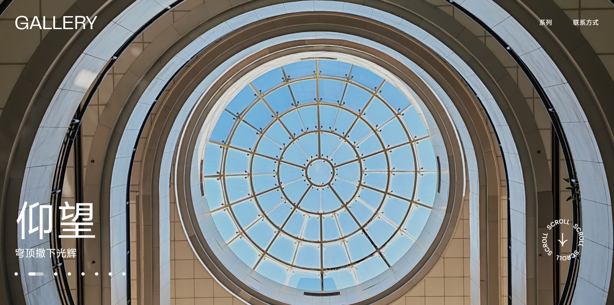

# Gallery · 明信片纪念册

> 一套关于烟台、光影与毕业的明信片作品集。

这是一个纯静态的摄影作品展示网站，包含 8 个系列、41 张明信片作品。项目以“电子纪念册”为概念，将照片与设计语言融合，呈现一种安静、内敛、适合翻阅的浏览体验。

## ✨ 预览



> 你可以直接访问 [在线链接](https://gallery-psi-vert.vercel.app/) 查看完整效果。

## 📸 系列作品

| 系列         | 简介                    |
|------------|-----------------------|
| **132合肥舰** | 钢铁的沉默与遗存，锈痕是时间的刻度。    |
| **海**      | 一座城市与海之间的对话，硬核与市井并存。  |
| **海滨叙事诗**  | 烟台的蓝调海岸线，松弛而治愈。       |
| **几何的沉默**  | 抽离色彩，只留下线条与光影交织。      |
| **蓝调时刻**   | 光线最暧昧的时刻，像电影截图一样安静。   |
| **山海印象**   | 开阔的城市肖像，看见一座城市的骨架与呼吸。 |
| **拾光**     | 街头巷尾偶遇的光，随意而真实。       |
| **雅顾**     | 虚焦拍摄，像蒙了一层纱的复古油画。     |

## 🛠️ 技术栈

- **框架**：Vue 3 + TypeScript
- **构建工具**：Vite
- **部署**：Vercel

## 🚀 本地运行

```bash
# 安装依赖
npm install

# 启动开发服务器
npm run dev

# 构建生产版本
npm run build
